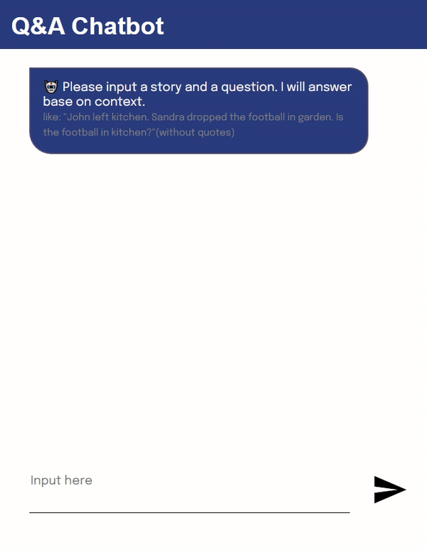

Q&A Chatbot
=========
Inspired by the paper from Meta Research lab, this project is a try to build a NLP model that embeded End to End Network and LSTM techniques.
Through training phase, the model tried to catch the relation between the words that it saw in training dataset. <br>
And when making the prediction, it will calculate the probobility of 'Yes' and 'No' among question words.<br>
If the probobility of 'Yes' is greater than 'No', the answer will be positive.<br>

Link of live demo page can be found at: <br>
https://rexxwei.github.io/portfolio/


Dependence
----
To make this project work, below libraries or features must included in your Python environment. 
  - Flask
  - SciKit-Learn
  - Pandas
  - Beautifulsoup4
  - Jinja2
  - Joblib
  - matplotlib
  - Numpy
  - Scipy
  - Seaborn
  
The dependence can be installed by execute below command
```css
pip install -r requirements.txt
```


How to Use
----
In the project directory, run the Python file 'app.py'.<br>
```css
python app.py
```
Then open a browser and try the address like:<br>
```css
localhost:8080
```


Limitation
----
Due to the small vocabulary size in the dataset, the words never shown up in the vocabulary won't be recoganized.<br>
Hope a bigger size vocabulary dataset will be available soon.<br>


Demo
=========

